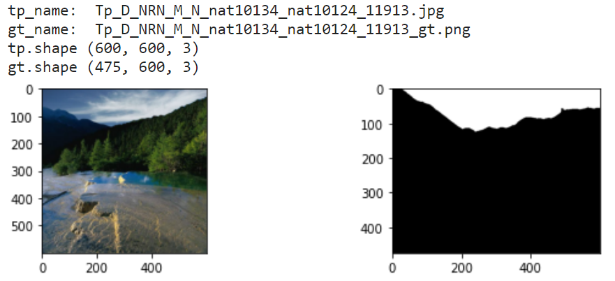
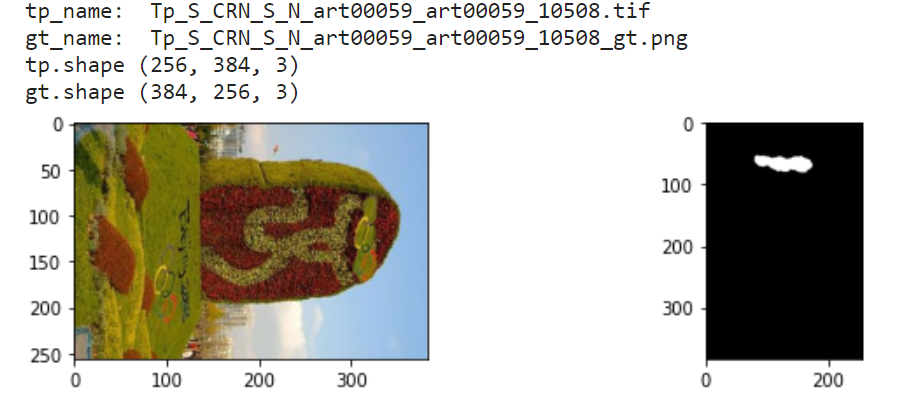
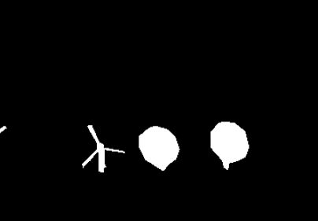

# 常见篡改检测定位数据集的勘误

**简体中文** | [English](./README.md)

## 简介
图像篡改检测（Image Manipulation Localization， IML）任务是检测并定位一张图像中被人为篡改的区域，可以被认为是PS，Photoshop等技术的反制技术。


然而，现有数据集中存在许多问题或分辨率不对齐的情况，这意味着被篡改的图像及其相应的掩码（mask）没有相同的分辨率。因此，本仓库致力于解决各种数据集中存在的类似问题。

例如，以下是CASIAv2数据集中存在问题的一些示例图像：





因此，我们收集了具有此问题的图像，并勘误了相应的掩码。

## 2 具体问题 及 已修正的下载链接
我们在此还指出了一些次要错误，并欢迎任何人提出Issue或提交Pull Request，分享篡改检测数据集中存在的各种问题，以便社区共同努力解决它们。
### 2.1 CASIAv1.0数据集
- **问题：** CASIAv1数据集中存在一张额外的图像（`CASIA1.0/Modified Tp/Tp/Sp_D_NRN_A_cha0011_sec0011_0542.jpg`），没有掩码。
- **解决方案：** 我们建议在训练或评估过程中将其移除。
  
### 2.2 CASIAv2.0数据集
- **问题：** 存在17张图像存在分辨率不对齐的问题。
  - 这些图像的文件名及图像与掩码的分辨率：
    ```
    [["Tp_D_CNN_M_N_sec00011_cha00085_11227.jpg", [256, 384, 3], [384, 256, 3]], 
    ["Tp_D_CRN_S_N_ani10191_ani10190_12437.jpg", [638, 336, 3], [336, 638, 3]],  
    ["Tp_D_CRN_S_N_nat10130_pla00049_11524.jpg", [256, 384, 3], [384, 256, 3]], 
    ["Tp_D_NND_M_B_nat20098_nat20073_01602.tif", [387, 581, 3], [382, 581, 3]], 
    ["Tp_D_NRN_M_N_nat10134_nat00095_11912.jpg", [600, 600, 3], [475, 600, 3]], 
    ["Tp_D_NRN_M_N_nat10134_nat10124_11913.jpg", [600, 600, 3], [475, 600, 3]], 
    ["Tp_S_CRN_S_N_art00059_art00059_10508.tif", [256, 384, 3], [384, 256, 3]], 
    ["Tp_S_NND_S_N_sec20064_sec20064_01654.tif", [647, 416, 3], [636, 416, 3]], 
    ["Tp_S_NNN_S_N_art20077_art20077_01883.tif", [867, 578, 3], [864, 573, 3]], 
    ["Tp_S_NNN_S_N_ind20037_ind20037_01778.tif", [578, 863, 3], [569, 862, 3]], 
    ["Tp_S_NNN_S_N_sec00012_sec00012_11230.jpg", [256, 384, 3], [384, 256, 3]], 
    ["Tp_S_NNN_S_N_sec00074_sec00074_00751.tif", [384, 256, 3], [384, 255, 3]], 
    ["Tp_S_NRD_S_N_arc20079_arc20079_01719.tif", [392, 591, 3], [383, 582, 3]], 
    ["Tp_S_NRD_S_N_pla20071_pla20071_01971.tif", [501, 760, 3], [499, 760, 3]], 
    ["Tp_S_NRN_S_B_ind10002_ind10002_20010.jpg", [600, 450, 3], [800, 600, 3]], 
    ["Tp_S_NRN_S_N_art20077_art20077_02316.tif", [863, 574, 3], [863, 572, 3]], 
    ["Tp_S_NRN_S_N_pla20080_pla20080_01980.tif", [781, 514, 3], [781, 512, 3]]]
    ```
- **解决方案：** 我们对其进行了修复，并发布了这些图像的下载链接。
  - 仅错误图像，请从[Google Drive](https://drive.google.com/file/d/14hd2d1pwlEk5ZD_xfIzmnI61m5fExKRC/view?usp=sharing)下载。
  - 仅错误图像，请从[百度网盘](https://pan.baidu.com/s/1W-pjkcnET92oq6-aTEojhw?pwd=n6f2)下载。
  - 完整修改过的数据集，请参考此[仓库](https://github.com/SunnyHaze/CASIA2.0-Corrected-Groundtruth)

### 2.3 COVERAGE dataset
- **问题：** 存在9张图像（27个掩码）存在分辨率不对齐的问题。
  ```
  41copy.tif
  41forged.tif
  41paste.tif
  48copy.tif
  48forged.tif
  48paste.tif
  55copy.tif
  55forged.tif
  55paste.tif
  56copy.tif
  56forged.tif
  56paste.tif
  57copy.tif
  57forged.tif
  57paste.tif
  58copy.tif
  58forged.tif
  58paste.tif
  59copy.tif
  59forged.tif
  59paste.tif
  61copy.tif
  61forged.tif
  61paste.tif
  95copy.tif
  95forged.tif
  95paste.tif
  ```
- **解决方案：** 我们对其进行了修复，并发布了这些图像的下载链接。
- 仅修订图像，请从[Google Drive](https://drive.google.com/file/d/1kZWnj5oWjIOC4oOBRAkXjvmWohao7zrk/view?usp=sharing)下载。
- 仅修订图像，请从[百度网盘](https://pan.baidu.com/s/1zPpYTOBdZd2qpFxXwCNh9g?pwd=0o9o)下载。
### 2.4 IMD2020数据集
- **问题：** 存在一张图像（`IMD2020/z14/00030_fake.jpg`）存在分辨率不对齐的问题。
- **解决方案：** 我们在上传了修订后的掩码，您可以直接下载该图片：
- 

## 3 支持和分享
- 如果您在IML领域的数据集中遇到任何其他问题，请随时在[Discussions](https://github.com/SunnyHaze/IML-Dataset-Corrections/discussions)中指出它们，并让开源社区共同解决。
- 如果您认为我们的工作有价值，请考虑给我们一个Star⭐️并与他人分享。您的支持有助于我们获得更多认可，并鼓励社区内的进一步合作。

------
<div align="center">
<a href="https://info.flagcounter.com/gNET"></a>
</div>
