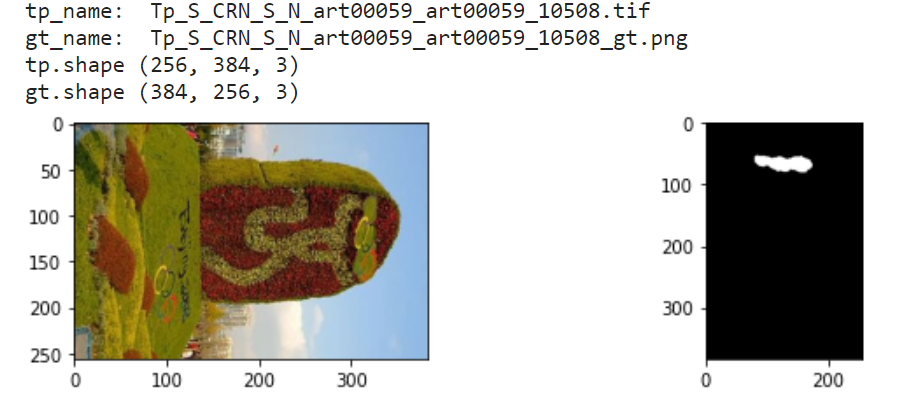

# Dataset Corrections for Common Image Manipulation Localization Datasets

 **English** | [简体中文](./README-zh.md)

## 1 Introduction
Image Manipulation Localization (IML) task involves detecting and locating tampered regions within images, which can be regarded as a countermeasure against methods like Photoshop or Deepfake.

However, there are many issues or resolution misalignment in the existing datasets, meaning the manipulated images and their corresponding masks do not have the same resolution. This is problematic, so this repository has addressed this issue present in various datasets.

For instance, here are some examples of problematic images in the CASIAv2 dataset:




Thus, we collected the images with this issue and revised the corresponding mask.

## 2 Issues & Corrected Download Links
We also point out some minor errors here, and welcome anyone to raise issues or submit pull requests to share various problems existing in the IML dataset, so that the community can work together to solve them.
### 2.1 CASIAv1.0 dataset
- **Issue:** There is an extra image (`CASIA1.0/Modified Tp/Tp/Sp_D_NRN_A_cha0011_sec0011_0542.jpg`) without a mask in the CASIAv1 dataset
- **Solution:** We recommend removing it during training or evaluation.
### 2.2 CASIAv2.0 dataset
- **Issue:** There are 17 images with resolution misalignment problems.
  - File name of these images and the resolution of images & masks:
    ```
    [["Tp_D_CNN_M_N_sec00011_cha00085_11227.jpg", [256, 384, 3], [384, 256, 3]], 
    ["Tp_D_CRN_S_N_ani10191_ani10190_12437.jpg", [638, 336, 3], [336, 638, 3]],  
    ["Tp_D_CRN_S_N_nat10130_pla00049_11524.jpg", [256, 384, 3], [384, 256, 3]], 
    ["Tp_D_NND_M_B_nat20098_nat20073_01602.tif", [387, 581, 3], [382, 581, 3]], 
    ["Tp_D_NRN_M_N_nat10134_nat00095_11912.jpg", [600, 600, 3], [475, 600, 3]], 
    ["Tp_D_NRN_M_N_nat10134_nat10124_11913.jpg", [600, 600, 3], [475, 600, 3]], 
    ["Tp_S_CRN_S_N_art00059_art00059_10508.tif", [256, 384, 3], [384, 256, 3]], 
    ["Tp_S_NND_S_N_sec20064_sec20064_01654.tif", [647, 416, 3], [636, 416, 3]], 
    ["Tp_S_NNN_S_N_art20077_art20077_01883.tif", [867, 578, 3], [864, 573, 3]], 
    ["Tp_S_NNN_S_N_ind20037_ind20037_01778.tif", [578, 863, 3], [569, 862, 3]], 
    ["Tp_S_NNN_S_N_sec00012_sec00012_11230.jpg", [256, 384, 3], [384, 256, 3]], 
    ["Tp_S_NNN_S_N_sec00074_sec00074_00751.tif", [384, 256, 3], [384, 255, 3]], 
    ["Tp_S_NRD_S_N_arc20079_arc20079_01719.tif", [392, 591, 3], [383, 582, 3]], 
    ["Tp_S_NRD_S_N_pla20071_pla20071_01971.tif", [501, 760, 3], [499, 760, 3]], 
    ["Tp_S_NRN_S_B_ind10002_ind10002_20010.jpg", [600, 450, 3], [800, 600, 3]], 
    ["Tp_S_NRN_S_N_art20077_art20077_02316.tif", [863, 574, 3], [863, 572, 3]], 
    ["Tp_S_NRN_S_N_pla20080_pla20080_01980.tif", [781, 514, 3], [781, 512, 3]]]
    ```
- **Solution:** We fixed them and released the download link for these images.
  - For only revised images, download from [Google Drive](https://drive.google.com/file/d/14hd2d1pwlEk5ZD_xfIzmnI61m5fExKRC/view?usp=sharing).
  - For only revised images, download from [Baidu Netdisk](https://pan.baidu.com/s/1W-pjkcnET92oq6-aTEojhw?pwd=n6f2).
  - For the full revised dataset, go to this [repo](https://github.com/SunnyHaze/CASIA2.0-Corrected-Groundtruth).
### 2.3 COVERAGE dataset
- **Issue:** There are 9 images (27 masks) with resolution misalignment problems.
  ```
  41copy.tif
  41forged.tif
  41paste.tif
  48copy.tif
  48forged.tif
  48paste.tif
  55copy.tif
  55forged.tif
  55paste.tif
  56copy.tif
  56forged.tif
  56paste.tif
  57copy.tif
  57forged.tif
  57paste.tif
  58copy.tif
  58forged.tif
  58paste.tif
  59copy.tif
  59forged.tif
  59paste.tif
  61copy.tif
  61forged.tif
  61paste.tif
  95copy.tif
  95forged.tif
  95paste.tif
  ```
- **Solution:** We fixed them and released the download link for these images.
  - For only revised images, download from [Google Drive](https://drive.google.com/file/d/1kZWnj5oWjIOC4oOBRAkXjvmWohao7zrk/view?usp=sharing).
  - For only revised images, download from [Baidu Netdisk](https://pan.baidu.com/s/1zPpYTOBdZd2qpFxXwCNh9g?pwd=0o9o).
### 2.4 IMD2020 dataset
- **Issue:** There is a single image(`IMD2020/z14/00030_fake.jpg`) with a resolution misalignment problem.
- **Solution:** We simply upload the revised mask here, you can just download it directly:
  - 

## 3 Supports and Sharing
- If you come across any other issues in datasets within the IML field, feel free to point out them in the [Discussions](https://github.com/SunnyHaze/IML-Dataset-Corrections/discussions) and let the open-source community work together to resolve them.
- If you find our work valuable, please consider giving us a star⭐️ and sharing it with others. Your support helps us gain more recognition and encourages further collaboration within the community.


------
<div align="center">
<a href="https://info.flagcounter.com/gNET"></a>
</div>
